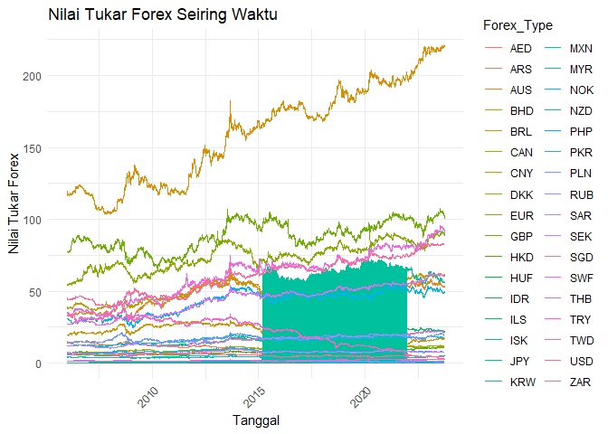
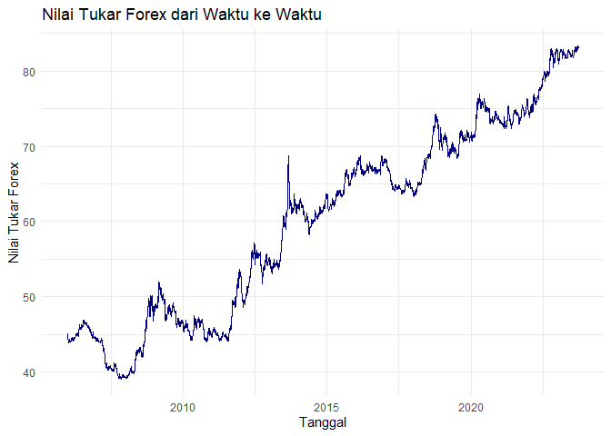
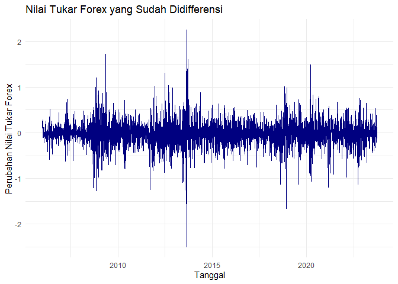
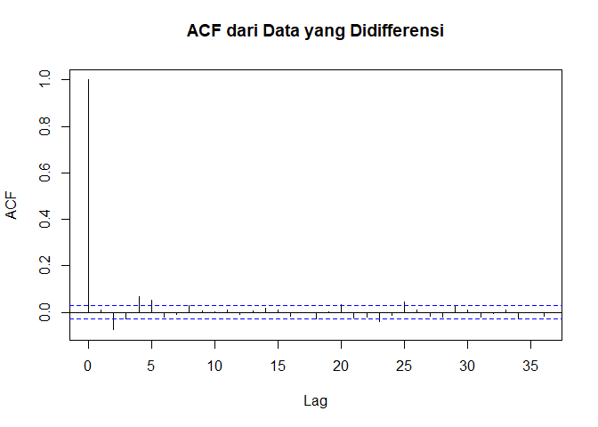
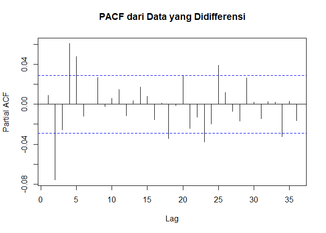
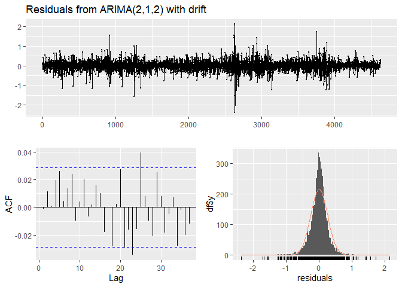
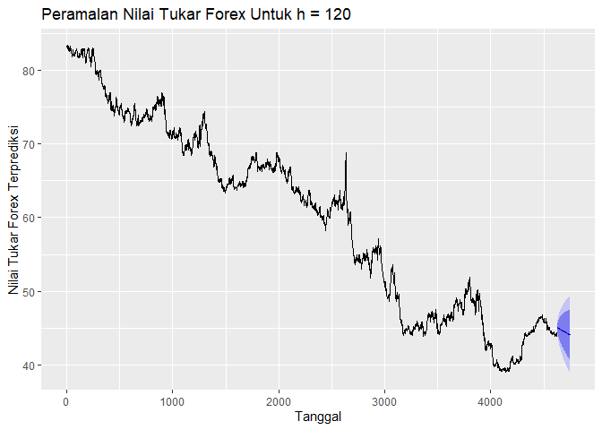

Model ARIMA untuk Prediksi Nilai Tukar Forex
================
Khoirul Mizan
5 Oktober 2024

### 1. Memuat Data

Kita akan menggunakan fungsi `read_csv()` untuk membaca dataset.

``` r
# Memuat dataset (Sesuaikan jalur file atau gunakan dataset nyata di R)
data <- read_csv("C:/Users/acer/Downloads/forex_data.csv")
```

    ## Rows: 4630 Columns: 36
    ## ── Column specification ────────────────────────────────────────────────────────
    ## Delimiter: ","
    ## dbl  (35): USD, AUS, CAN, SWF, DKK, EUR, GBP, HKD, IDR, JPY, KRW, MYR, NOK, ...
    ## date  (1): Date
    ## 
    ## ℹ Use `spec()` to retrieve the full column specification for this data.
    ## ℹ Specify the column types or set `show_col_types = FALSE` to quiet this message.

``` r
# Menampilkan beberapa baris pertama dataset
head(data)
```

    ## # A tibble: 6 × 36
    ##   Date         USD   AUS   CAN   SWF   DKK   EUR   GBP   HKD     IDR   JPY
    ##   <date>     <dbl> <dbl> <dbl> <dbl> <dbl> <dbl> <dbl> <dbl>   <dbl> <dbl>
    ## 1 2023-09-29  83.0  53.4  61.2  90.7  11.8  89.0  101.  10.6 0.00537  55.6
    ## 2 2023-09-28  83.2  53.4  61.6  90.9  11.8  89.2  101.  10.6 0.00538  55.7
    ## 3 2023-09-27  83.2  52.8  61.6  90.3  11.7  89.1  101.  10.6 0.00535  55.6
    ## 4 2023-09-26  83.2  53.2  61.6  90.9  11.8  89.3  101.  10.6 0.00537  55.8
    ## 5 2023-09-25  83.1  53.4  61.8  91.1  11.8  89.1  102.  10.6 0.00539  55.8
    ## 6 2023-09-22  83.0  53.4  61.5  91.4  11.8  89.7  102.  10.6 0.00540  55.9
    ## # ℹ 25 more variables: KRW <dbl>, MYR <dbl>, NOK <dbl>, NZD <dbl>, SEK <dbl>,
    ## #   SGD <dbl>, THB <dbl>, TWD <dbl>, ZAR <dbl>, AED <dbl>, ARS <dbl>,
    ## #   BRL <dbl>, CNY <dbl>, HUF <dbl>, ILS <dbl>, ISK <dbl>, MXN <dbl>,
    ## #   PHP <dbl>, PKR <dbl>, PLN <dbl>, RUB <dbl>, SAR <dbl>, TRY <dbl>,
    ## #   VEF <dbl>, BHD <dbl>

#### Penjelasan:

Langkah ini bertujuan untuk memuat data nilai tukar Forex ke dalam
environment R. Kita menggunakan fungsi `read_csv()` dari paket `readr`
untuk membaca data.

### 2. Preprocessing Data

Sebelum melakukan analisis lebih lanjut dengan model ARIMA, penting
untuk memastikan bahwa data telah diolah dengan benar. Tahap ini
termasuk menangani nilai yang hilang (missing values), memeriksa adanya
outlier, dan melakukan normalisasi data jika diperlukan.

#### Menangani Missing Values dan Interpolasi

Langkah pertama adalah menangani nilai yang hilang dalam dataset. Kita
akan memeriksa apakah ada missing values dan menangani mereka dengan
cara yang sesuai, misalnya menggunakan interpolasi atau menghapus baris
dengan missing values.

``` r
# Memeriksa missing values
missing_summary <- colSums(is.na(data))
print(missing_summary)
```

    ## Date  USD  AUS  CAN  SWF  DKK  EUR  GBP  HKD  IDR  JPY  KRW  MYR  NOK  NZD  SEK 
    ##    0    0    0    0    0    0    0    0    0  368    0  454    1    0    0    0 
    ##  SGD  THB  TWD  ZAR  AED  ARS  BRL  CNY  HUF  ILS  ISK  MXN  PHP  PKR  PLN  RUB 
    ##    0    0    0    0    0    0    0    0    0 1036 1036    0 1036  317    0    0 
    ##  SAR  TRY  VEF  BHD 
    ##    0    0 4610    0

``` r
# Menghapus kolom VEF dan menginterpolasi missing values dengan metode linear
data_clean <- data %>%
  select(-VEF) %>%  # Menghapus kolom VEF
  mutate(across(everything(), ~ na.approx(., na.rm = FALSE)))  # Interpolasi missing values

# Mengubah kolom 'Date' ke format datetime
data_clean$Date <- as.Date(data_clean$Date)

# Menampilkan data yang sudah dibersihkan dari missing values
head(data_clean)
```

    ## # A tibble: 6 × 35
    ##   Date         USD   AUS   CAN   SWF   DKK   EUR   GBP   HKD     IDR   JPY
    ##   <date>     <dbl> <dbl> <dbl> <dbl> <dbl> <dbl> <dbl> <dbl>   <dbl> <dbl>
    ## 1 2023-09-29  83.0  53.4  61.2  90.7  11.8  89.0  101.  10.6 0.00537  55.6
    ## 2 2023-09-28  83.2  53.4  61.6  90.9  11.8  89.2  101.  10.6 0.00538  55.7
    ## 3 2023-09-27  83.2  52.8  61.6  90.3  11.7  89.1  101.  10.6 0.00535  55.6
    ## 4 2023-09-26  83.2  53.2  61.6  90.9  11.8  89.3  101.  10.6 0.00537  55.8
    ## 5 2023-09-25  83.1  53.4  61.8  91.1  11.8  89.1  102.  10.6 0.00539  55.8
    ## 6 2023-09-22  83.0  53.4  61.5  91.4  11.8  89.7  102.  10.6 0.00540  55.9
    ## # ℹ 24 more variables: KRW <dbl>, MYR <dbl>, NOK <dbl>, NZD <dbl>, SEK <dbl>,
    ## #   SGD <dbl>, THB <dbl>, TWD <dbl>, ZAR <dbl>, AED <dbl>, ARS <dbl>,
    ## #   BRL <dbl>, CNY <dbl>, HUF <dbl>, ILS <dbl>, ISK <dbl>, MXN <dbl>,
    ## #   PHP <dbl>, PKR <dbl>, PLN <dbl>, RUB <dbl>, SAR <dbl>, TRY <dbl>, BHD <dbl>

#### Penjelasan:

Di sini, kita memeriksa dan menghitung jumlah nilai yang hilang (missing
values) di dalam dataset. Kolom ‘VEF’ dihapus, dan kita menginterpolasi
nilai yang hilang menggunakan metode linear. Kemudian, kolom ‘Date’
diubah ke format datetime agar dapat digunakan dalam analisis lebih
lanjut.

### 3. Analisis Data Eksploratif (EDA)

Tahap ini dilakukan untuk memahami struktur dataset dan
memvisualisasikan isi datanya.

``` r
# Ubah data dari wide format ke long format
datalong <- data_clean %>%
  pivot_longer(cols = -Date, names_to = "Forex_Type", values_to = "Rate")

# Membuat line chart untuk semua nilai tukar Forex
ggplot(datalong, aes(x = Date, y = Rate, color = Forex_Type)) + 
  geom_line() + 
  labs(title = "Nilai Tukar Forex Seiring Waktu", x = "Tanggal", y = "Nilai Tukar Forex") + 
  theme_minimal() +
  theme(axis.text.x = element_text(angle = 45, hjust = 1))
```

    ## Warning: Removed 4248 rows containing missing values or values outside the scale range
    ## (`geom_line()`).

<!-- -->

``` r
# Statistik deskriptif dari dataset
summary(data_clean)
```

    ##       Date                 USD             AUS             CAN       
    ##  Min.   :2006-01-02   Min.   :39.08   Min.   :29.97   Min.   :36.24  
    ##  1st Qu.:2010-06-09   1st Qu.:46.68   1st Qu.:42.15   1st Qu.:44.46  
    ##  Median :2014-11-15   Median :62.30   Median :49.98   Median :51.51  
    ##  Mean   :2014-11-15   Mean   :60.11   Mean   :47.94   Mean   :50.47  
    ##  3rd Qu.:2019-04-23   3rd Qu.:70.91   3rd Qu.:54.08   3rd Qu.:55.55  
    ##  Max.   :2023-09-29   Max.   :83.31   Max.   :61.52   Max.   :65.61  
    ##                                                                      
    ##       SWF             DKK              EUR             GBP        
    ##  Min.   :32.60   Min.   : 7.030   Min.   :53.87   Min.   : 65.22  
    ##  1st Qu.:45.51   1st Qu.: 8.744   1st Qu.:67.32   1st Qu.: 81.18  
    ##  Median :66.11   Median : 9.815   Median :74.24   Median : 88.04  
    ##  Mean   :61.46   Mean   : 9.808   Mean   :74.16   Mean   : 88.42  
    ##  3rd Qu.:71.49   3rd Qu.:10.908   3rd Qu.:81.49   3rd Qu.: 97.63  
    ##  Max.   :95.67   Max.   :12.373   Max.   :92.19   Max.   :107.74  
    ##                                                                   
    ##       HKD              IDR              JPY               KRW        
    ##  Min.   : 5.017   Min.   :0.0044   Min.   : 0.3258   Min.   :0.0561  
    ##  1st Qu.: 6.010   1st Qu.:0.0049   1st Qu.: 0.5395   1st Qu.:0.0628  
    ##  Median : 8.035   Median :0.0051   Median : 0.6512   Median :4.0244  
    ##  Mean   : 7.721   Mean   :0.0360   Mean   :26.7848   Mean   :3.1303  
    ##  3rd Qu.: 9.047   3rd Qu.:0.0054   3rd Qu.:61.7587   3rd Qu.:5.6402  
    ##  Max.   :10.652   Max.   :0.5104   Max.   :72.4884   Max.   :6.3172  
    ##                   NA's   :368                        NA's   :454     
    ##       MYR             NOK              NZD             SEK        
    ##  Min.   :11.50   Min.   : 6.413   Min.   :24.60   Min.   : 5.548  
    ##  1st Qu.:14.22   1st Qu.: 7.664   1st Qu.:33.46   1st Qu.: 6.735  
    ##  Median :16.69   Median : 8.060   Median :45.55   Median : 7.611  
    ##  Mean   :15.99   Mean   : 8.173   Mean   :42.41   Mean   : 7.505  
    ##  3rd Qu.:17.73   3rd Qu.: 8.480   3rd Qu.:48.79   3rd Qu.: 8.075  
    ##  Max.   :20.63   Max.   :11.375   Max.   :54.39   Max.   :10.574  
    ##  NA's   :1                                                        
    ##       SGD             THB             TWD             ZAR       
    ##  Min.   :26.25   Min.   :1.099   Min.   :1.200   Min.   :3.976  
    ##  1st Qu.:33.83   1st Qu.:1.436   1st Qu.:1.478   1st Qu.:4.838  
    ##  Median :47.13   Median :1.887   Median :2.022   Median :5.308  
    ##  Mean   :44.20   Mean   :1.827   Mean   :1.966   Mean   :5.454  
    ##  3rd Qu.:51.60   3rd Qu.:2.199   3rd Qu.:2.294   3rd Qu.:6.096  
    ##  Max.   :62.62   Max.   :2.490   Max.   :2.758   Max.   :7.553  
    ##                                                                 
    ##       AED             ARS              BRL             CNY        
    ##  Min.   :10.65   Min.   : 0.240   Min.   :12.48   Min.   : 5.208  
    ##  1st Qu.:12.71   1st Qu.: 1.620   1st Qu.:17.38   1st Qu.: 6.912  
    ##  Median :16.96   Median : 7.230   Median :20.76   Median : 9.817  
    ##  Mean   :16.36   Mean   : 7.315   Mean   :21.20   Mean   : 8.981  
    ##  3rd Qu.:19.30   3rd Qu.:12.060   3rd Qu.:26.17   3rd Qu.:10.381  
    ##  Max.   :22.68   Max.   :15.320   Max.   :29.33   Max.   :12.195  
    ##                                                                   
    ##       HUF              ILS             ISK              MXN       
    ##  Min.   :0.1845   Min.   :11.86   Min.   :0.3653   Min.   :3.007  
    ##  1st Qu.:0.2264   1st Qu.:15.34   1st Qu.:0.4609   1st Qu.:3.611  
    ##  Median :0.2374   Median :17.75   Median :0.5444   Median :3.745  
    ##  Mean   :0.2379   Mean   :18.03   Mean   :0.5258   Mean   :3.876  
    ##  3rd Qu.:0.2480   3rd Qu.:21.30   3rd Qu.:0.5860   3rd Qu.:4.139  
    ##  Max.   :0.3051   Max.   :24.59   Max.   :0.6653   Max.   :5.167  
    ##                   NA's   :1036    NA's   :1036                    
    ##       PHP              PKR              PLN             RUB        
    ##  Min.   :0.9659   Min.   :0.2688   Min.   :12.72   Min.   :0.5398  
    ##  1st Qu.:1.2833   1st Qu.:0.4611   1st Qu.:16.01   1st Qu.:1.0652  
    ##  Median :1.3747   Median :0.5508   Median :17.33   Median :1.3872  
    ##  Mean   :1.3396   Mean   :0.5299   Mean   :17.33   Mean   :1.3588  
    ##  3rd Qu.:1.4412   3rd Qu.:0.6064   3rd Qu.:18.72   3rd Qu.:1.6485  
    ##  Max.   :1.5583   Max.   :1.4591   Max.   :21.41   Max.   :2.0731  
    ##  NA's   :1036     NA's   :317                                      
    ##       SAR             TRY             BHD       
    ##  Min.   :10.43   Min.   : 3.03   Min.   :103.8  
    ##  1st Qu.:12.45   1st Qu.:12.37   1st Qu.:123.8  
    ##  Median :16.61   Median :26.51   Median :165.2  
    ##  Mean   :16.02   Mean   :22.06   Mean   :159.4  
    ##  3rd Qu.:18.90   3rd Qu.:30.60   3rd Qu.:188.0  
    ##  Max.   :22.21   Max.   :37.66   Max.   :221.0  
    ## 

``` r
# Memvisualisasikan nilai tukar Forex dari waktu ke waktu
ggplot(data_clean, aes(x = Date, y = USD)) +
  geom_line(color = 'navy') +
  labs(title = "Nilai Tukar Forex dari Waktu ke Waktu",
       x = "Tanggal",
       y = "Nilai Tukar Forex") +
  theme_minimal()
```

<!-- -->

#### Penjelasan:

Pada tahap ini, kita menampilkan **statistik deskriptif** dataset dan
membuat grafik garis yang menggambarkan **nilai tukar Forex** dari waktu
ke waktu.

### 4. Pengujian Stasioneritas dengan Augmented Dickey-Fuller (ADF) Test

Kita perlu memastikan bahwa data deret waktu **stasioner** sebelum
menerapkan model ARIMA.

``` r
# Pengujian stasioneritas menggunakan Augmented Dickey-Fuller (ADF) Test
adf_result <- adf.test(data_clean$USD, alternative = "stationary")

# Menampilkan hasil uji ADF
print(adf_result)
```

    ## 
    ##  Augmented Dickey-Fuller Test
    ## 
    ## data:  data_clean$USD
    ## Dickey-Fuller = -2.6954, Lag order = 16, p-value = 0.2839
    ## alternative hypothesis: stationary

#### Penjelasan:

Pengujian **Augmented Dickey-Fuller (ADF)** digunakan untuk mengecek
apakah data sudah stasioner. Jika nilai p-value lebih kecil dari 0,05,
maka data dianggap stasioner.

### 5. Pendiferensian Data

Jika hasil ADF test menunjukkan bahwa data tidak stasioner, kita akan
melakukan proses **differencing**.

``` r
# Menerapkan differencing pada data
data_diff <- diff(data_clean$USD)

# Memvisualisasikan data yang sudah didifferensi
ggplot() +
  geom_line(aes(x = data_clean$Date[-1], y = data_diff), color = 'navy') +
  labs(title = "Nilai Tukar Forex yang Sudah Didifferensi",
       x = "Tanggal",
       y = "Perubahan Nilai Tukar Forex") +
  theme_minimal()
```

<!-- -->

#### Penjelasan:

Jika data tidak stasioner, kita menerapkan **differencing** untuk
menghilangkan tren dan membuat data lebih stabil untuk model ARIMA.

### 6. Plot ACF dan PACF

Grafik **Autocorrelation Function (ACF)** dan **Partial Autocorrelation
Function (PACF)** membantu dalam menentukan **orde** model ARIMA (p, d,
q).

``` r
# Plot ACF dan PACF
acf(data_diff, main = "ACF dari Data yang Didifferensi")
```

<!-- -->

``` r
pacf(data_diff, main = "PACF dari Data yang Didifferensi")
```

<!-- -->

#### Penjelasan:

Grafik **ACF** digunakan untuk melihat hubungan data dengan lag
sebelumnya, sedangkan **PACF** digunakan untuk menentukan urutan AR
dalam model ARIMA.

### 7. Penerapan Model ARIMA

Selanjutnya, kita akan menerapkan model ARIMA menggunakan fungsi
`auto.arima()`.

``` r
# Membangun model ARIMA
arima_model <- auto.arima(data_clean$USD)

# Menampilkan ringkasan model
summary(arima_model)
```

    ## Series: data_clean$USD 
    ## ARIMA(2,1,2) with drift 
    ## 
    ## Coefficients:
    ##         ar1      ar2      ma1     ma2    drift
    ##       0.244  -0.6297  -0.2355  0.5475  -0.0082
    ## s.e.  0.115   0.0699   0.1243  0.0749   0.0036
    ## 
    ## sigma^2 = 0.06624:  log likelihood = -283.17
    ## AIC=578.33   AICc=578.35   BIC=616.97
    ## 
    ## Training set error measures:
    ##                        ME      RMSE       MAE          MPE      MAPE     MASE
    ## Training set 4.764445e-05 0.2572089 0.1789201 0.0002115105 0.3070391 1.001277
    ##                      ACF1
    ## Training set -0.001034149

#### Penjelasan:

Fungsi `auto.arima()` digunakan untuk memilih model ARIMA terbaik secara
otomatis berdasarkan parameter optimal yang dihitung.

### 8. Diagnostik Model

Setelah model ARIMA dibuat, penting untuk mengecek residu model.

``` r
# Plot residu dan pengecekan pola residu
checkresiduals(arima_model)
```

<!-- -->

    ## 
    ##  Ljung-Box test
    ## 
    ## data:  Residuals from ARIMA(2,1,2) with drift
    ## Q* = 9.8138, df = 6, p-value = 0.1327
    ## 
    ## Model df: 4.   Total lags used: 10

#### Penjelasan:

Pada langkah ini, kita menganalisis **residu** model untuk memastikan
bahwa tidak ada pola sistematis yang tersisa, yang menunjukkan bahwa
model sudah cocok.

### 9. Peramalan dengan Model ARIMA

Langkah terakhir adalah melakukan peramalan nilai tukar Forex untuk
beberapa periode ke depan.

``` r
# Meramalkan 120 periode ke depan
forecast_values <- forecast(arima_model, h = 120)

# Plot hasil peramalan
autoplot(forecast_values) +
  labs(title = "Peramalan Nilai Tukar Forex Untuk h = 120",
       x = "Tanggal",
       y = "Nilai Tukar Forex Terprediksi")
```

<!-- -->

#### Penjelasan:

Dengan model ARIMA yang telah dibuat, kita dapat melakukan **peramalan**
untuk jangka waktu ke depan (dalam hal ini, 120 periode). Grafik
peramalan menunjukkan nilai tukar yang diprediksi beserta interval
kepercayaannya.

### 10. Kesimpulan

Dalam analisis ini, kita telah membangun model ARIMA untuk memprediksi
nilai tukar Forex. Dimulai dengan **analisis data eksploratif**,
kemudian pengujian stasioneritas dengan **ADF Test**, dan juga,
menerapkan **differencing**. Setelah itu, kita menggunakan **ACF** dan
**PACF** untuk menentukan parameter ARIMA, membangun model, memeriksa
residu, dan melakukan **peramalan** untuk beberapa periode ke depan.
Dengan mengidentifikasi tren dan pola historis, model ARIMA memberikan
peramalan yang dapat diandalkan asalkan datanya diproses dengan benar
dan mengikuti prinsip analisis deret waktu yang tepat.
